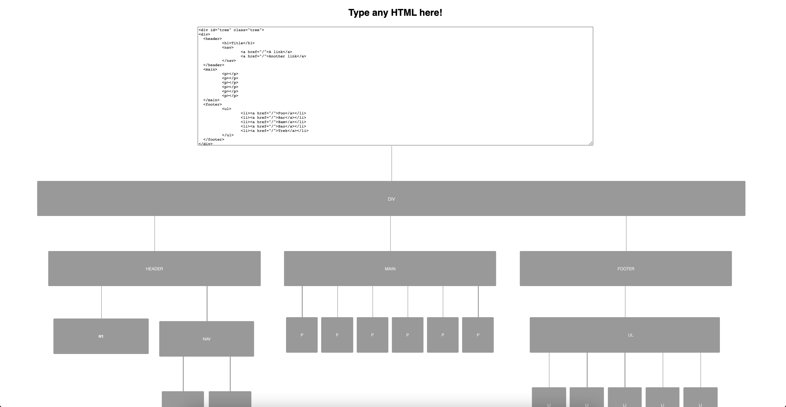

# What is this?

This app is a HTML tree visualizer made in Svelte. This was mostly a learning experience for Svelte.

Uses BFS to traverse the HTML tree and mostly CSS to render the tree on the page.

Includes a really basic editor for a user to add HTML to render on the screen. The UI will update as new HTML is added.

## Example

